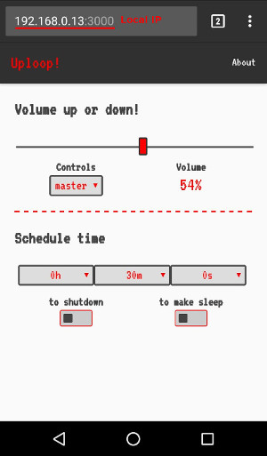
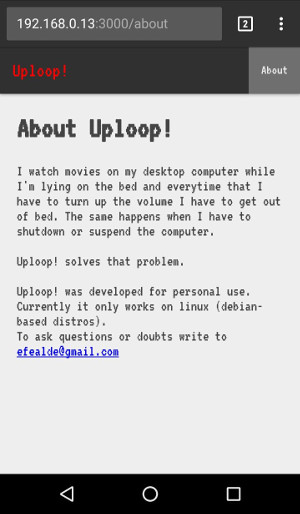

# Uploop!
Control system sound and schedule time to suspend or shutdown computer!

 

## Usage

1. Install dependencies:

`npm install`

2. Build app:

`npm run build`

3. Run Server on pc:

`npm run server`

4. Browse to pc local IP address with mobile device.

---

*The IP address is shown after run server (anyway you can execute `ifconfig` to find it).*

*Node version latest ( or > **v8.5.0**).*

*The app was developed for personal use, and only was tested on Ubuntu 16.04 LTS.*

---

### Thanks:
- [preact](https://github.com/developit/preact)
- [preact-boilerplate](https://github.com/developit/preact-boilerplate)
- [socket.io](https://github.com/socketio/socket.io)
- [express](https://github.com/expressjs/express)

